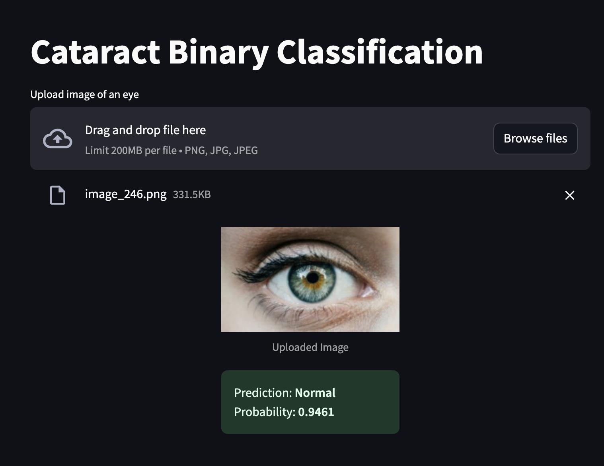

# Cataract Binary Classification

This project provides a machine learning-based solution for classifying eye images to determine if the eye shows signs of cataracts. The model uses a fine-tuned **EfficientNet-B0** architecture to predict whether an image belongs to the "Cataract" or "Normal" class.

The model achieved 98.36% accuracy on the holdout dataset. More details in [Project Report](https://docs.google.com/document/d/1KfH6fVNJZXXpRWjPOsDJ2fT2urjExHhpuTjELu3iM_Q/edit?usp=sharing)

The system consists of three parts:
1. **Backend API**: A FastAPI server for handling image uploads and predictions.
2. **Frontend App**: A Streamlit app for users to upload images and view the prediction results.
3. **Model Training**: Source code for fine-tuning models.

## Project Tree

```bash
cataract-classifier/
│
├── backend/                              # directory for FastAPI code
│   └── __init__.py
│   └── main.py                           # backend entrypoint
│
├── cataract_classifier/                  # ML source code
│   └── __init__.py
│   └── data.py                           # contains CataractDataset class and split utility
│   └── evaluate.py                       # evaluation metrics for monitoring on epoch end
│   └── predict.py                        # predict target given an image or image paths
│   └── train.py                          # main training script for finetuning
│
├── docs/                                 # directory for documentation
│
├── frontend/                             # directory for Streamlit code
│   └── app.py                            # frontend entrypoint
│
├── input/                                # Directory for datasets
│   └── processed_images/                 # Unzipped kaggle dataset
│       ├── test/
│       └── train/
│
├── notebooks/                            # Jupyter Notebooks for exploration / experiments
│
├── results/                              # Results directory
│   └── efficientnet_b0/                  # Folder name is same as model name for saving results
│       └── finetuned_efficientnet_b0.pt  # Saved model
│       └── ...                           # Other artifacts (saved during training)
│
├── .gitignore
├── .pre-commit-config.yaml
├── LICENSE
├── main.py                           # Run to start finetuning
├── pyproject.toml                    # Project configuration
├── README.md
└── uv.lock                           # Package dependencies (preferred)
```

## Setup Environment

1. Clone the repo.

    ```bash
    gh repo clone HimanshuMittal01/cataract-classifier

    # OR using https method:
    # git clone https://github.com/HimanshuMittal01/cataract-classifier.git
    ```

2. Create virtual environment and install packages
- Using `uv`

    ```
    uv venv --python 3.10
    source .venv/bin/activate
    uv sync
    ```

- Using `pip`

    ```zsh
    python3 -m venv .venv
    source .venv/bin/activate
    pip install .
    ```

3. Download the dataset from Kaggle: [Cataract Image Dataset](https://www.kaggle.com/datasets/nandanp6/cataract-image-dataset) and put it in `input/` directory.

4. Fetch the classifier model. You have two options, either:
- directly download the results from [google drive link](https://drive.google.com/drive/folders/1XgRdz71DEOhuSHSpAf64CP-JHmcj9mG-?usp=drive_link) *(~17MB; open till Dec 15, 2024)* and put it in project root directory
- or, train your custom model using `main.py` script. Usage:

    Simply run
    ```
    python main.py
    ```

    There are other options as well you can specify for e.g. `num-epochs`.
    ```
    python main.py --num-epochs 4

    # See all options using `python main.py --help`
    ```

5. Verify that your project directory matches this [project tree](#project-tree). Now, you are ready to launch the app.

## Launch App

**1. Start the backend server:**

```zsh
fastapi dev backend/main.py

# Use `uv run fastapi dev backend/main.py` if you're using `uv`
# Use `fastapi run backend/main.py` for production
```

Verify that API is running successfully at http://127.0.0.1:8000/ </br>
View API docs at http://127.0.0.1:8000/docs

**2. Start the frontend server:**

```zsh
streamlit run frontend/app.py
```

This will open http://localhost:8501/ in the browser where you can upload images and predict 'cataract' or 'normal'.

<p align="center">

</p>

### Potential Improvements:
- [ ] Write API example requests and responses
- [ ] Write a custom CNN model
- [ ] Provide three options for model in the frontend
